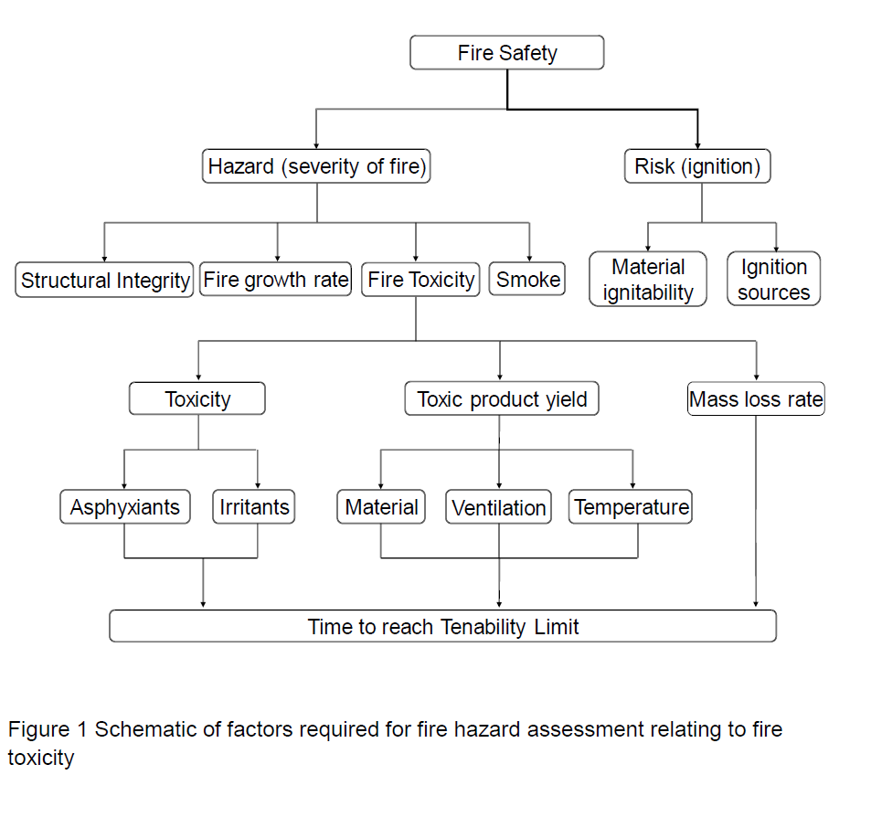

- Fire behavior calculations
- simulating fire growth for constant conditions using a minimum travel time
  (MTT Minimum Travel Time) algorithm
- Time Series
- Surveillance
-  **基于BIM构建应急预案** 

- AFRD's criteria for inspection `The Atlanta Fire Rescue Department`[AFRD]

- fire load[火灾载荷]

-  Fire hazard assessment

  - the most probable fire scenarios
  - prediction of the rate of fire growth
  - the amount of fuel present
  - its impact on the occupants and their ability to escape safely

- ISO 135713 subdivides the hazards to people escaping from a fire into the effects of

  - heat
  - asphyxiant gas 窒息性气体
  - irritant gases 刺激性气体
  - visual obscuration by smoke 烟雾对视觉的遮蔽
  - 将四个组成部分分别对待，当四个中的其中一个达到了阻止潜在受害者逃脱的水平时，将其定义为 untenability (不可维持)

  

  

- Fire Toxicity

- The stages of fire growth