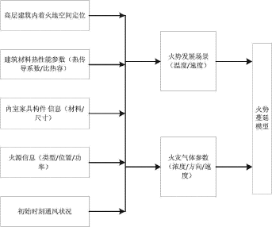
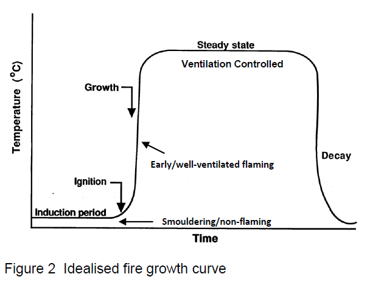

- et al. [等人]
  -  Dataset1 is collected by Foggia et al. [14], containing 31 videos which cover different environments. 
- etc. [等物]
- e.g. [ e.g. = for example ]
  -  We need helpers of all types, engineers, scientists ( e.g. geologists) and teachers  
-  i.e.  [i.e.=that is / in other] 用来进一步解释前面所表明的观点。 
	- different abnormal events i.e., fire, accidents, and other emergencies. 
- 引用人家的表(adapt)
  - A cross-reference for BI to potential flame length, fireline intensity and descriptions of expected
prescribed burning and fire suppression conditions is provided in Table 1(adapted from Deeming et al. 1977). 
- cross-reference
  - 交叉引用就是在文档的一个位置引用文档另一个位置的内容，类似于超级链接，只不过交叉引用一般是在同一文档中互相引用而已。
  - A cross-reference for BI to potential flame length, fireline intensity and descriptions of expected
prescribed burning and fire suppression conditions is provided in Table 1(adapted from Deeming et al. 1977). [我就说这些内容见表一，要看自己找去]

​       传统烟雾探测方法[conventional smoke detection methods] have used special devices to detect smoke。

​        Computer vision based approach using images or image sequences is useful for the smoke detection.   

​         In this processing, we consider 考虑到烟的特性[characteristic properties of smoke] such as 【比如说增长的速度和不固定的形状】a growth speed and a non-stationary shape  

- a best practice for using data to inform fire inspections  **使用数据影响消防检查**
- fire data analysis
- 燃烧源分类
- reducing heat release rate, reducing flame spread, and reducing smoke and toxic gas production

## 大型高层建筑室内火灾紧急疏散指标逃生方法及系统

- 火源信息[建筑物内的传感器提供，包括火源类型和火源位置]
  - 传感器[温度传感器、烟雾探测传感器、红外传感器和超声波传感器]
- 建立火势蔓延动态模型
  - 根据得到的火源信息，在数据库中查询与该火源信息相匹配的火情信息和建筑物信息
    - 火情信息：火源热释放速率、火灾负荷、室内可燃材料特性
    - 建筑物信息：室内可燃材料特性、建筑结构形式和建筑轰然的发生
      -  轰然是火灾从局部燃烧迅速过渡到封闭空间内所有可燃物都卷入燃烧的一种现象. 
      -  火区内的所有可燃物达到点燃温度,所有物品便同时被点燃,“轰”的一下,整个封闭空间就会全面燃烧起来.
      - 据有关方面试验数据显示,当用易燃、可燃材料进行内部装修时,轰然在3min之内即可发生；
      - 当采用难燃材料时,轰然在4-5min内发生；
      - 当使用不燃烧材料时,轰然在6-8min内发生；
      - 未装修的建筑,轰燃一般发生在8min之后. 
  - 根据查询到的信息建立火灾蔓延动态模型
    - 对火势发展现场
      - 火势的温度和速度
    - 以及火灾气体参数进行预测
      - 浓度、方向、速度
- 火势和烟气传播特性的预测
  - 根据得到的火势蔓延动态模型，传感器采集的烟气参数和特性以及人体对有毒物质的承受能力，遵循避让高温和低能见度的原则。
- 为防止火情的误报，一旦发生火情后，由预警着火点周围传感器采集的数据和现场人员人工进行火情的二次确认；在救火过程中不断根据火情现场传感器采集的数据进行实时修正、完善火势蔓延动态模型。

- 安全的疏散要求大型高层建筑人员“必需安全疏散时间”(RSET)必须小于“可用安全疏散时间”(ASET)。必需安全疏散时间RSET是指从起火时刻起到人员疏散到安全区域的时间。紧急情况下的RSET包括火灾探测时间($t_{alarm}$)、预动作时间$t_{pre}$ 和人员疏散运动时间($t_{move}$)

  - $ RSET = t_{alarm} + t_{pre} + t_{move}$
  - 火灾探测时间 $t_{alarm}$ 可通过火势蔓延动态模型以及探测系统的特性进行计算和预测
  - 预动作时间 $t_{pre} $ 因与人员的心理行为特征，人员的年龄、对建筑物的熟悉程度、人员反应的灵敏性有关，难预测，所以采用平均时间进行估算。
  - 人员疏散运动时间 $ t_{move}$ 主要取决于人员密度、人员疏散速度、安全出口宽度等，可以利用简单的经验公式进行预测。
  - 可用安全疏散时间 ASET 是指从起火时刻到火灾对人员安全构成危险状态的时间。
  - 一般情况下，可根据热辐射通晕、烟气温度以及烟气中有毒气体的浓度来表示危险状态。

  

## The correlation between carbon monoxide and hydrogen cyanide in fire effluents of flame retarded polymers
### Quantification of Toxic Fire Hazards

估算火灾排放物中混合气体毒性的一般方法是假定各有毒物的累加行为，并将每一种毒气的浓度表示为该气体在暴露30分钟的情况下将导致50%种群死亡率的浓度的分数(LC50)。

The general approach for estimating the toxicity of gas mixtures contained in fire effluents is to assume additive behaviour of individual toxicants, and to express the concentration of each as its fraction of the lethal concentration for 50% of the population for a 30 minute exposure (LC50).

## 5 Key Stages to Risk Assessment

### Stage 1： Identify Fire Hazards 

For a fire to start, tree things are needed:

- A source of ignition
- Fuel
- Oxgen

#### Identify sources of ignition

​	

#### identify sources of fuel

- 可燃液体
- 易燃化学品
- 包装材料
- 纺织物和软装(室内装饰品)
- 废弃物
- 易燃气体，比如液化石油气
- 建筑材料是怎么帮助火焰的传播的

#### identify sources of oxygen

- 通过门窗自然流动的气流

- 通风系统[封闭建筑]

An ideal method of identifying and recording these hazards is by use a simple checklist.

#### 消防安全检查表

by  East Sussex Fire & Rescue Service 

- Is the fire warning system tested and maintained?
- Is the firefighting equipment provided appropriate for the risk?
- Is escape lighting provided?
- Are all designated escape routes and doors usable, clear and unobstructed, and do they lead to a place of final safety?
- Are there suitable fire escape and direction signs?
-  Are fire doors, walls, floors and ceilings in a good state of repair? 

- Are there any wall coverings or decor which could spread fire easily?
-  Is there a fire emergency and evacuation plan as to the action to be taken and by whom? 
-  Do all staff receive induction and regular fire and evacuation training? 

## Home Fire
In just two minutes, a fire can become life-threatening. In five minutes, a residence can be engulfed in flames.

- **Fire is FAST! **In less than 30 seconds a small flame can turn into a major fire. It only takes minutes for thick black smoke to fill a house or for it to be engulfed in flames.
- **Fire is HOT! **Heat is more threatening than flames. Room temperatures in a fire can be 100 degrees at floor level and rise to 600 degrees at eye level. Inhaling this super-hot air will scorch your lungs and melt clothes to your skin.
- **Fire is DEADLY! **Smoke and toxic gases kill more people than flames do. Fire produces poisonous gases that make you disoriented and drowsy. Asphyxiation is the leading cause of fire deaths, exceeding burns by a three-to-one ratio.

## Assessment of the fire toxicity of building insulation materials

Most fire deaths, and most fire injuries result from inhalation of toxic fire effluents

Fire gas toxicity is increasingly being recognised as a major factor in the assessment of fire hazard.

Prediction of toxic fire hazard depends on two parameters

- **Time-concentration profiles**  for major products. These depend on the **fire
  growth curve** and the **yields of toxic products**.
- **Toxicity of the products**, based on estimates of doses likely to impair escape
  efficiency, cause incapacitation, or death.

Toxic product yields depend on the material composition5, and the fire conditions.

**The most significant differences in fire conditions arise between flaming and non-flaming combustion .**

In well-ventilated fires, the amount of toxic species generated are generally small, so extinguishment or escape is still feasible.

However, as they grow, all fires become ventilation controlled, and fires in enclosures such as buildings can change rapidly from well-ventilated to under-ventilated.

- Under-ventilated fires are larger, and therefore produce larger quantities of effluent, endangering occupants over a much greater part of any building.

## Fire Gas Toxicity
- Fire gases contain a mixture of fully oxidised products, such as carbon dioxide (CO2)
- partially oxidised products, such as carbon monoxide (CO)
-  hydrogen cyanide (HCN) 
**CO** is one of the most toxicologically significant components in fire gases, preventing oxygen transport by the formation of carboxyhaemoglobin.

**HCN** is also important because it prevents uptake of oxygen by the cells.

**CO2** (not specifically toxic, but replaces O2 and increases respiration rate).

**The presence of CO2 in blood**, which stimulates hyperventilation, increases the respiration rate and hence the hazard from the toxic components of the fire gas.

**Oxygen depletion deprives the body of oxygen (hypoxia) with fatal consequences at concentrations below 14%.**

### Purser's FED model

$
\mathrm{FED}=\left\{\frac{[\mathrm{CO}]}{\mathrm{LC}_{50, \mathrm{CO}}}+\frac{[\mathrm{HCN}]}{\mathrm{LC}_{50, \mathrm{HCN}}}+\frac{[\mathrm{HCl}]}{\mathrm{LC}_{50, \mathrm{HCl}}}+\ldots .\right\} \times \mathrm{V}_{\mathrm{CO}_{2}}+\mathrm{A}+\frac{21-\left[\mathrm{O}_{2}\right]}{21-5.4}
$

A is an acidosis factor equal to [CO ] 0.05

This expresses the ratio of the concentration of each
toxicant to its lethal concentration, and then multiplies the sum of these ratios by the hyperventilation factor. 
>自己写的
>
>$V_{CO_2}$ as a multiplication factor to show that the increased >respiration rate resulting from inhalation of $CO_2$   aggravated the >harmful effect of all the other toxic gases.

It also incorporates an acidosis factor A, to account for the toxicity of CO2 in its own right.

$
\mathrm{V}_{\mathrm{CO}_{2}}=1+\frac{\exp \left(0.14\left[\mathrm{CO}_{2}\right]\right)-1}{2}
$

A number of other toxic and irritant gas species also **contribute** to the hazard from fire gases **to a lesser extent**.

concentrations for incapacitation (**IC50**) for **irritant gases**

the concentrations for lethality for all gases (for 50% of the population over a 30 minute exposure, “30 min **LC50**”).

- Fire toxicity can also be expressed as an LC5

## Fire Hazard Analysis Techniques

## A Data Mining Method for Potential Fire Hazard Analysis of Urban Buildings based on Bayesian Network 

## Fire Data Analysis and Feature Reduction Using Computational Intelligence Methods
Recent studies show that temperature, ionization, photoelectric, and CO sensors together
make an optimal sensor set for residential fire detection

### Contribution of Features to the Fire Detection

### The Distributed Approach Using Data Fusion
A notion of detecting events inside each sensor nodes (irrespective to the available sensor
types in the sensor nodes) and then fuse the all results in a higher level is presented
in [3]. Figure 5 shows the **general topology (一般拓扑图)**  of this approach.

## Gaining an Understanding of the National Fire Danger Rating System
A cross-reference for BI to potential flame length, fireline intensity and descriptions of expected
prescribed burning and fire suppression conditions is provided in Table 1 (adapted from
Deeming et al. 1977). 

由于NFDRS中各物理量的单位均采用的是英
制单位，为保持其方法计算式的一致性，文章中未
进行单位转换。在各指标的计算式中，采用的长度
单位为英尺（ft），热量单位为英热（Btu），质量单位
为磅（lb），时间单位为分钟（min）或秒（s）。

| FireDanger Rating and Color Code | Description |
| :-:| :--|
|Low (L)(Green) | Fuels do not ignite readily from small firebrands although a more intense heat source, such as lightning, may start fires in duff or punky wood. Fires in open cured grasslands may burn freely a few hours after rain, but woods fires spread slowly by creeping or smoldering, and burn in irregular fingers. There is little danger of spotting|
| Moderate (M)(Blue)|Fires can start from most accidental causes, but with the exception of lightning fires in some areas, the number of starts is generally low. Fires in open cured grasslands will burn briskly and spread rapidly on windy days. Timber fires spread slowly to moderately fast. The average fire is of moderate intensity, although heavy concentrations of fuel, especially draped fuel, may burn hot. Short-distance spotting may occur, but is not persistent. Fires are not likely to become serious and control is relatively easy.|
|High (H)(Yellow) | All fine dead fuels ignite readily and fires start easily from most causes. Unattended brush and campfires are likely to escape. Fires spread rapidly and short-distance spotting is common. High-intensity burning may develop on slopes or in concentrations of fine fuels. Fires may become serious and their control difficult unless they are attacked successfully while small.|
| Very High (VH)(Orange) | Fires start easily from all causes and, immediately after ignition, spread rapidly and increase quickly in intensity. Spot fires are a constant danger. Fires burning in light fuels may quickly develop high intensity characteristics such as long-distance spotting and fire whirlwinds when they burn into heavier fuels.|
|Extreme (E) (Red)| Fires start quickly, spread furiously, and burn intensely. All fires are potentially serious. Development into high intensity burning will usually be faster and occur from smaller fires than in the very high fire danger class. Direct attack is rarely possible and may be dangerous except immediately after ignition. Fires that develop headway in heavy slash or in conifer stands may be unmanageable while the extreme burning condition lasts. Under these conditions the only effective and safe control action is on the flanks until theweather changes or the fuel supply lessens.|

The actual determination of the daily adjective rating is based on the current or predicted value
for a user selected staffing index and ignition component using the table below. 

